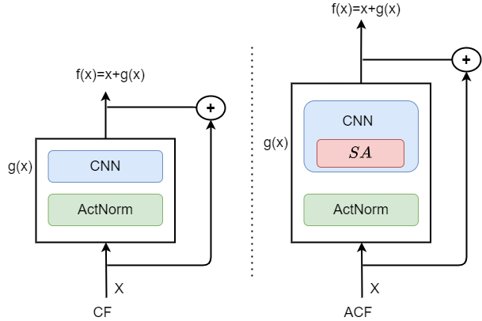
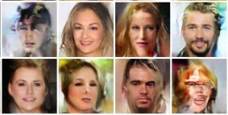
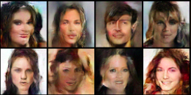

# Attentive Contractive Flow with Lipschitz-constrained Self-Attention [[arxiv](https://arxiv.org/abs/2109.12135)]

## Architecture:




Building on the use of [Residual Flow](https://arxiv.org/abs/1906.02735) and other similar contractive normalizing flows in generative modeling, we propose:
+ Using a lipschitz constrained self attention mechanism that attends over the whole image at once.
+ Use of two kinds of lipschitz continuous self attention function: The L~2 Self Attention and the Lipschitz Normalization Scheme of Self Attention.

As a result, Attentive Contractive Flows offer better expresivity and outperforms or becomes competitive with state-of-the-art contractive flow methods.

| Samples from Residual Flow         |  Samples from Attentive Contractive Flow    |
| --------------------------- | --------------------------- |
|       | |

## Requirements

 - PyTorch 1.0+
 - Python 3.6+

## Preprocessing
ImageNet:
1. Follow instructions in `preprocessing/create_imagenet_benchmark_datasets`.
2. Convert .npy files to .pth using `preprocessing/convert_to_pth`.
3. Place in `data/imagenet32` and `data/imagenet64`.

CelebAHQ 64x64 5bit:

1. Download from https://github.com/aravindsrinivas/flowpp/tree/master/flows_celeba.
2. Convert .npy files to .pth using `preprocessing/convert_to_pth`.
3. Place in `data/celebahq64_5bit`.

CelebAHQ 256x256:
```
# Download Glow's preprocessed dataset.
wget https://storage.googleapis.com/glow-demo/data/celeba-tfr.tar
tar -C data/celebahq -xvf celeb-tfr.tar
python extract_celeba_from_tfrecords
```

## Density Estimation Experiments

***NOTE***: By default, O(1)-memory gradients are enabled. However, the logged bits/dim during training will not be an actual estimate of bits/dim but whatever scalar was used to generate the unbiased gradients. If you want to check the actual bits/dim for training (and have sufficient GPU memory), set `--neumann-grad=False`. Note however that the memory cost can stochastically vary during training if this flag is `False`.

MNIST:
```
python train_img.py --data mnist --imagesize 28 --actnorm True --wd 0 --save experiments/mnist
```

CIFAR10:
```
python train_img.py --data cifar10 --actnorm True --save experiments/cifar10
```

ImageNet 32x32:
```
python train_img.py --data imagenet32 --actnorm True --nblocks 32-32-32 --save experiments/imagenet32
```

ImageNet 64x64:
```
python train_img.py --data imagenet64 --imagesize 64 --actnorm True --nblocks 32-32-32 --factor-out True --squeeze-first True --save experiments/imagenet64
```

CelebAHQ 256x256:
```
python train_img.py --data celebahq --imagesize 256 --nbits 5 --actnorm True --act elu --batchsize 8 --update-freq 5 --n-exact-terms 8 --fc-end False --factor-out True --squeeze-first True --nblocks 16-16-16-16-16-16 --save experiments/celebahq256
```

## BibTeX
```
@misc{mukherjee2021attentive,
      title={Attentive Contractive Flow with Lipschitz-constrained Self-Attention}, 
      author={Avideep Mukherjee and Badri Narayan Patro and Vinay P. Namboodiri},
      year={2021},
      eprint={2109.12135},
      archivePrefix={arXiv},
      primaryClass={cs.CV}
}
```
